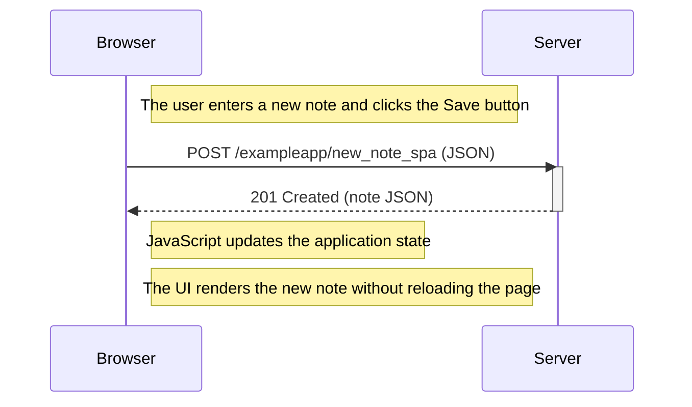

```mermaid
sequenceDiagram
    participant Browser
    participant Server

    Note right of Browser: The user enters a new note and clicks the Save button

    Browser->>Server: POST /exampleapp/new_note_spa (JSON)
    activate Server
    Server-->>Browser: 201 Created (note JSON)
    deactivate Server

    Note right of Browser: JavaScript updates the application state
    Note right of Browser: The UI renders the new note without reloading the page

```
